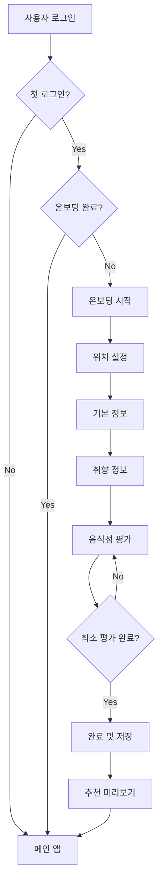

# 🎯 What2Eat 온보딩 시스템 가이드

## 📋 개요

What2Eat의 온보딩 시스템은 **넷플릭스/스포티파이 스타일**의 사용자 취향 수집을 통해 개인화된 맛집 추천을 제공합니다.

## 🚀 주요 기능

### 1. 첫 로그인 감지
- Firebase auth_logs를 통한 첫 로그인 여부 자동 감지
- 온보딩 완료 상태 추적

### 2. 단계별 정보 수집
1. **환영 단계**: 온보딩 프로세스 소개
2. **위치 정보**: 주요 방문 지역 설정
3. **기본 정보**: 연령, 성별, 식사 스타일, 예산
4. **취향 정보**: 매운맛 정도, 알러지, 선호 음식
5. **음식점 평가**: 1-5점 평가 시스템
6. **완료**: 설정 요약 및 추천 미리보기

### 3. 지능형 평가 시스템
- 높은 점수(4점 이상) 음식점의 유사 음식점 자동 확장
- 최소 평가 개수 조건 (기본 5개)
- 실시간 진행률 표시

## 🏗️ 시스템 구조

```
What2Eat/
├── src/
│   ├── main.py                    # 메인 앱 (온보딩 플로우 통합)
│   ├── pages/
│   │   ├── __init__.py
│   │   └── onboarding.py          # 온보딩 페이지 클래스
│   └── utils/
│       ├── auth.py                # 첫 로그인 감지 함수들
│       └── onboarding.py          # 온보딩 매니저 클래스
└── test_onboarding.py             # 온보딩 테스트 페이지
```

## 🔧 핵심 컴포넌트

### 1. 인증 시스템 (`utils/auth.py`)

```python
def is_first_login() -> bool:
    """현재 사용자가 첫 로그인인지 확인"""

def has_completed_onboarding() -> bool:
    """사용자가 온보딩을 완료했는지 확인"""
```

### 2. 온보딩 매니저 (`utils/onboarding.py`)

```python
class OnboardingManager:
    def get_popular_restaurants_by_location(location: str) -> List[Dict]
    def get_similar_restaurants(restaurant_id: str) -> List[Dict]
    def save_user_profile(profile_data: Dict, ratings_data: Dict) -> bool
    def validate_onboarding_data(profile_data: Dict, ratings_data: Dict) -> List[str]
    def get_recommendation_preview(profile_data: Dict, ratings_data: Dict) -> List[Dict]
```

### 3. 온보딩 페이지 (`pages/onboarding.py`)

```python
class OnboardingPage:
    def render(): 단계별 UI 렌더링
    def _render_welcome_step(): 환영 페이지
    def _render_location_step(): 위치 설정
    def _render_basic_info_step(): 기본 정보 수집
    def _render_taste_preferences_step(): 취향 정보 수집
    def _render_restaurant_rating_step(): 음식점 평가
    def _render_completion_step(): 완료 및 요약
```

## 💾 데이터 구조

### 사용자 프로필 데이터
```python
user_profile = {
    "location": "서울시 강남구",
    "location_method": "manual",  # or "auto"
    "birth_year": 1990,
    "gender": "남성",
    "dining_companions": ["혼밥", "데이트", "친구모임"],
    "regular_budget": "1-2만원",
    "special_budget": "2-5만원", 
    "spice_level": 2,  # 0-5
    "allergies": "새우, 견과류",
    "dislikes": "생선",
    "food_preferences": ["한식", "양식", "일식"]
}
```

### 음식점 평가 데이터
```python
restaurant_ratings = {
    "rating_rest_1": 4,
    "rating_rest_2": 5,
    "rating_similar_1_1": 3,
    # ...
}
```

## 🧪 테스트 방법

### 1. 테스트 페이지 실행
```bash
streamlit run src/test_onboarding.py
```

### 2. 메인 앱에서 테스트
1. 새 계정으로 로그인
2. 첫 로그인 시 자동으로 온보딩 페이지 표시
3. 단계별 진행 테스트

### 3. 강제 온보딩 테스트
- 테스트 페이지에서 "온보딩 시작" 버튼 클릭
- 기존 사용자도 온보딩 과정 체험 가능

## 🎨 UI/UX 특징

### 1. 넷플릭스/스포티파이 스타일
- 단계별 진행바
- 카드 형태의 음식점 표시
- 슬라이더를 통한 직관적 평가

### 2. 반응형 디자인
- 컬럼 레이아웃 활용
- 모바일 친화적 UI
- 색상 코딩된 이미지

### 3. 사용자 경험
- 실시간 진행률 피드백
- 유효성 검사 및 오류 메시지
- 추천 미리보기 제공

## 🔄 플로우 다이어그램



## 🚧 향후 개선사항

### 1. 데이터베이스 연동
- [ ] Firestore 실제 저장/로드 구현
- [ ] 실제 음식점 데이터 연동
- [ ] 추천 알고리즘 고도화

### 2. UI/UX 개선
- [ ] 애니메이션 효과 추가
- [ ] 음식점 이미지 실제 연동
- [ ] 지도 기반 위치 선택

### 3. 기능 확장
- [ ] 소셜 로그인 연동
- [ ] 친구 추천 기능
- [ ] A/B 테스트 적용

## 📞 문의 및 지원

온보딩 시스템 관련 문의사항이나 버그 리포트는 이슈 트래커를 통해 제출해 주세요.

---

**개발자**: What2Eat Team  
**마지막 업데이트**: 2024년 12월  
**버전**: 1.0.0 